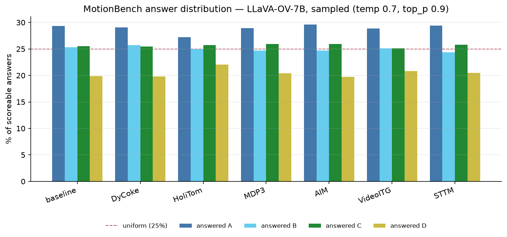

# MotionBench — Consolidated Findings

Training-free video-LLM efficiency methods evaluated on **MotionBench** (8,052 samples · 4,018 scoreable · 4,034 NA), 32 frames, greedy decoding unless stated. Every headline number passed a two-signal gate: the method logged that it engaged **and** its predictions diverged from the plain backbone.

Generated by `scripts/build_findings.py` — regenerate with `scripts/fetch_results.sh && python3 scripts/build_findings.py --local`.

---

## 1. The three findings

**1 — The backbone dominates the method.** Qwen3-VL-8B baseline **62.52%** vs LLaVA-OV-7B **52.66%**: a **+9.86** gap (χ²=127.5). No efficiency method on either backbone comes close to closing that.

**2 — Method effects do not transfer across backbones.** On LLaVA-OV *no* method differs significantly from its baseline. On Qwen3-VL, at identical settings, **all 10 lose accuracy and 8 lose significantly**. A ranking measured on one backbone must not be assumed on another.

**3 — Retention matters ~5× more on the stronger backbone.** Across a 10%→25% token budget, the largest movement on LLaVA-OV is **+0.85**; on Qwen3-VL FlashVID moves **+4.63** and FastV **+3.68**. See §3.

---

## 2. Gated results at the standard config (32 frames, 15% retention)

| Rank | Method | LLaVA-OV-7B | Qwen3-VL-8B |
|:-:|---|:---:|:---:|
| — | *baseline* | *52.66%* | *62.52%* |
| | PruneVID | 38.20% | **62.17%** |
| | DyCoke | **53.36%** | 61.85% |
| | HoliTom | 53.14% | 60.33% |
| | MDP3 | 53.06% | 59.66% |
| | AIM | 52.86% | 55.97% |
| | VideoITG | 52.86% | 56.35% |
| | FlashVID | 53.31% | 56.65% |
| | STTM | 51.72% | 57.07% |
| | VisionZip | 40.09% | 58.81% † |
| | FastV | 36.78% | 59.01% |

† VisionZip on Qwen3-VL is a **labelled partial** — the *contextual* half only. Qwen3-VL's vision tower has no CLS token, so the *dominant* half is not implementable. Never quote it as plain "VisionZip".

---

## 3. Retention sweep — 16 cells

Only the retention knob varies; 32 frames and every other parameter held fixed. Retention was verified **arithmetically from each run's ACTIVE log**, not merely from the CLI flag. **Bold** = significant loss vs that backbone's baseline (McNemar χ² ≥ 3.84).

**LLaVA-OV-7B** (baseline 52.66%)

| Method | r=0.10 | r=0.15 | r=0.25 | Δ across range |
|---|:---:|:---:|:---:|:---:|
| **FastV** | **36.06% (-16.60)** | **36.78% (-15.88)** | **36.73% (-15.93)** | +0.67 |
| **FlashVID** | 52.51% (-0.15) | 53.31% (+0.65) | 53.36% (+0.70) | +0.85 |
| **HoliTom** | 52.76% (+0.10) | 53.14% (+0.48) | 53.41% (+0.75) | +0.65 |
| **PruneVID** | **38.10% (-14.56)** | **38.20% (-14.46)** | **38.38% (-14.28)** | +0.27 |

**Qwen3-VL-8B** (baseline 62.52%)

| Method | r=0.10 | r=0.15 | r=0.25 | Δ across range |
|---|:---:|:---:|:---:|:---:|
| **FastV** | **56.92% (-5.60)** | **59.01% (-3.51)** | **60.60% (-1.92)** | **+3.68** |
| **FlashVID** | **54.73% (-7.79)** | **56.65% (-5.87)** | **59.36% (-3.16)** | **+4.63** |
| **HoliTom** | **60.05% (-2.47)** | **60.33% (-2.19)** | **60.43% (-2.09)** | +0.37 |
| **PruneVID** | **60.23% (-2.29)** | 62.17% (-0.35) | **61.40% (-1.12)** | +1.17 (non-monotonic) |

> ### What the sweep shows
>
> On **LLaVA-OV** the methods fall into two flat regimes that retention does not move: FlashVID and HoliTom sit *at* baseline at every setting, while FastV and PruneVID sit ~15 points below at every setting. **What costs accuracy there is that they prune, not how hard.**
>
> On **Qwen3-VL** the same methods respond strongly and their significance decays as tokens are restored (FastV χ² 89.8 → 44.6 → 18.2), i.e. they converge on the baseline.
>
> **Scope:** only 4 of 11 methods expose a comparable retention knob. The rest fix their budget internally or select frames rather than tokens, so this is a claim about these four, not about the field.
>
> **Anomaly, flagged rather than smoothed:** PruneVID on Qwen3-VL is non-monotonic — its r=0.15 midpoint is both its best cell and its only non-significant one. At the ±1.54 pt resolution floor this may be noise; it is not reported as a trend.

---

## 4. Answer distribution (sampled runs)

**Not gated results.** These use `temperature=0.7, top_p=0.9` instead of greedy decoding, so they cannot pass the divergence check and are **not comparable** to §2 or §3. Their purpose is to expose answer bias that an accuracy figure hides. Sampling was verified effective: 23.7% of DyCoke's and 22.6% of HoliTom's predictions differ from their greedy counterparts.

| Method | A | B | C | D | unparsed | accuracy |
|---|:---:|:---:|:---:|:---:|:---:|:---:|
| *ground truth* | *25.4%* | *25.6%* | *25.5%* | *23.6%* | *—* | *—* |
| baseline | 29.3% | 25.3% | 25.5% | 19.9% | 6 | 52.26% |
| DyCoke | 29.0% | 25.7% | 25.4% | 19.8% | 6 | 52.19% |
| HoliTom | 27.2% | 25.0% | 25.7% | 22.1% | 6 | 51.00% |
| MDP3 | 28.9% | 24.7% | 25.9% | 20.4% | 3 | 50.67% |
| AIM | 29.6% | 24.7% | 25.9% | 19.7% | 6 | 51.07% |
| VideoITG | 28.9% | 25.1% | 25.1% | 20.8% | 2 | 51.34% |
| STTM | 29.4% | 24.4% | 25.8% | 20.5% | 6 | 51.52% |

*Pending: FlashVID.*

> **The answer bias belongs to the backbone, not the methods.** Every row — including the plain baseline — over-picks **A** and under-picks **D**, against a near-uniform ground truth. No method introduces the bias and none corrects it; they inherit it.
>
> The contrast that makes this view worth having: in the *greedy* runs, FastV and PruneVID collapse to **~47% 'D'**. That collapse *is* a method artifact, and it is invisible in an accuracy column.

---

## 5. Methods on their own native backbones

| Method | Backbone | Accuracy | Note |
|---|---|:---:|---|
| PruneVID | PLLaVA-7B | **44.13%** | its published backbone |
| DyTo (reconstructed TW-FINCH) | LLaVA-NeXT Vicuna-7B | **42.06%** | see below |
| VisionZip | LLaVA-1.5-7B | **39.97%** | predates the gate; weights since deleted (disk) |
| STTM-LLaVAVid | LLaVA-Video-7B | **53.33%** | predates the gate |
| iMove, TrajViT | — | — | no public code or weights |

### DyTo against a token-matched control

A frame-matched baseline is **impossible** here: Vicuna's 4,096-token context cannot hold 32 uncompressed frames (18,432 tokens). That limitation is precisely why DyTo exists, so the meaningful control holds the *token budget* fixed instead.

| | frames | visual tokens | accuracy |
|---|:---:|:---:|:---:|
| baseline | 6 (uncompressed) | 3,456 | **43.35%** |
| DyTo | 32 → FINCH ~25 → ToMe | ~3,680 | **42.06%** |
| **Δ** | | | **−1.29** |

**McNemar win 177 / lose 229, χ² = 6.4 → significant**, with 622/4018 (15.5%) scoreable divergence confirming the method engaged.

**At an equal token budget, compressing 32 frames is significantly worse than sampling 6 and not compressing** — a negative result against DyTo's own premise. Caveats: this is our *reconstructed* TW-FINCH, not the authors' released code (which is unrunnable — see [UPSTREAM_DEFECTS.md](UPSTREAM_DEFECTS.md)); and DyTo received slightly *more* budget than the baseline, so the comparison favours it.

---

## 6. How to trust these numbers

Every gated figure required **two** independent signals: an `ACTIVE` log proving the mechanism ran, **and** predictions differing from the plain backbone proving it changed the output. The second is decisive — four separate ports completed cleanly, reported plausible accuracy, and had done nothing at all:

| Method | Symptom | Cause |
|---|---|---|
| FastV (LLaVA-OV) | 52.66%, looked like a result | `apply_fastv()` was a stub |
| PruneVID (LLaVA-OV) | printed ACTIVE, 0/8052 divergence | mask hooks discarded; build prunes via `kv_cache` |
| STTM (Qwen3-VL) | 0/8 divergence | visual span is not contiguous — Qwen3-VL interleaves timestamp tokens |
| Vicuna baseline | completed, exit 0 | 4.5× context overflow; 73% empty output |

Greedy decoding makes reruns bit-identical, which is what gives "0 predictions differ" its force as proof of a no-op. See [DETERMINISM_AND_VALIDITY.md](DETERMINISM_AND_VALIDITY.md) and [METHODOLOGY.md](METHODOLOGY.md).

